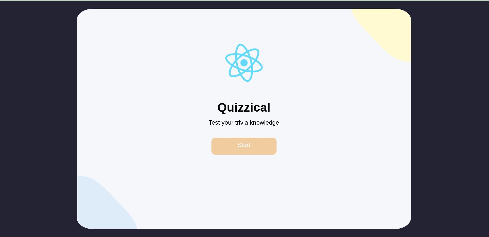
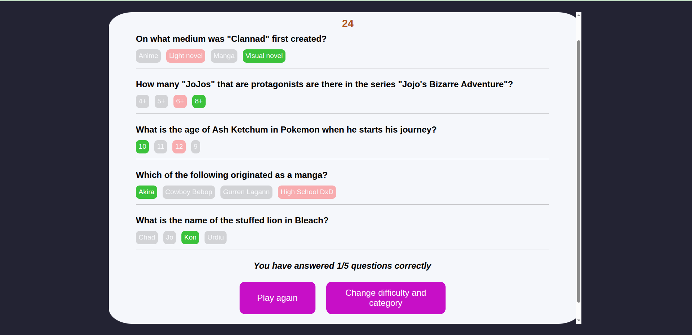

# Quizzical

A single-page quiz web app made with React. Makes me nostalgic...
It was from a now-updated awesome Scrimba course [posted on FreeCodeCamp's Youtube channel](https://www.youtube.com/watch?v=x4rFhThSX04&pp=ygUSZnJlZWNvZGVjYW1wIHJlYWN0) which taught me React.

